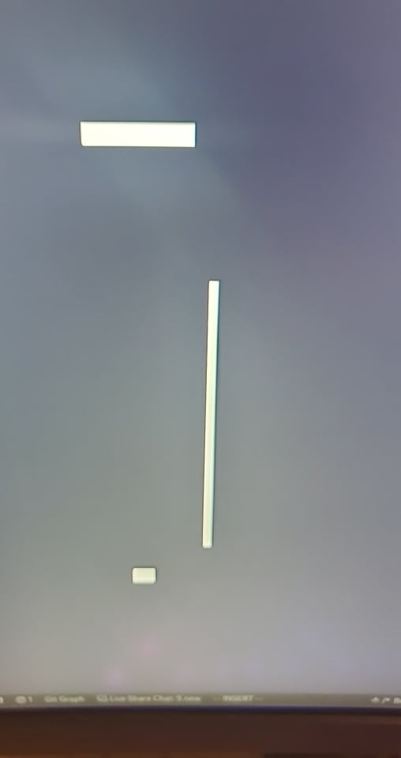
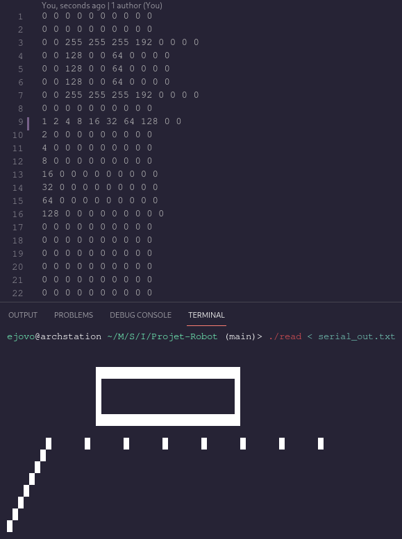

# Projet Robot

## Guide de répertoires
- `Servo_testing/` contient un programme arduino pour tester la fonctionnement du moteur qui dirige le capteur acoustique.
- `libraries/` contient les bibliotheques nécessaires pour interagir avec le hardware attaché au robot. La bibliothèque `NewPing` nous permet d'interagir avec le capteur acoustique, `Servo` nous permet d'interagir avec le moteur pour changer la direction du capteur acoustique, et finalement `ejovo` est une bibliothèque écrit par nous pour stocker la pièce cartographé dans une facon ultra efficace en utilisant une matrice (abstraction de tableau de deux dimension) des `uint8_t` pour répresenter un carré dans la vraie pièce avec un bit (1 pour un mur, 0 pour le sol). Finalement, le programme C `read_matrix.c` nous permet de transformer la matrice des `uint8_t` enregistré par le robot cartographeur à une visualisation dans le terminale.
- `media/` contient des photos de la pièce cartographée.

### ./
- `main.ino` contient le code qui régit notre petit robot cartographeur.
- `read` est un binaire (dont le code source est disponible dans `read_matrix.c`) compilé avec `gcc` sur un x86_64 système linux. Ce programme accepte comme donnée d'entrée un fichier `.txt` d'une matrice de dimension 2 des `uint8_t` qui repésente une pièce cartographé par notre robot. `read` affiche au terminal une visualization de la pièce.
- `serial_out.txt` est un exemple des données de sorties de notre robot cartographeur, pris du terminal serial de l'arduino. Pour visualiser l'exemple, appeler `./read < serial_out.txt`. Attention, l'exemple de `serial_out.txt` n'est pas une vraie donnée de sortie de notre robot, il a été créé pour tester la fonctionnement du binaire `read`.

## Pièces Cartographées

Voici deux exemples des cartes qui sont produites par notre robot après avoir fait le tour d'une pièce rectangulaire (1) et d'une couloir (2). Les murs ne sont pas toujours connectés (voire présents) parce que il existe des incohérences dans la vrai vie au niveau de pouvoir dans la batterie, distance traversés, angle exacte entre le mur et robot (qui est présumé d'être parallèle), etc.

(1)

(2) - excusez la photo d'écran...

### serial_out.txt Exemple

Cette photo montre comment une pièce peut être chargé en mémoire d'une manière ultra efficace en utilisant une matrice des `uint8_t`. Comme une `255` est représenté en binaire comme `11111111`, on utilise cette valeur pour stocker un segment horizantale d'un mur. En effet, on peut discretiser une pièce en 80 x 80 carrés en utilisant la moindre de mémoire possible - dans une matrice 80 x 10 des `uint8_t` - comme on économise chaque bit.